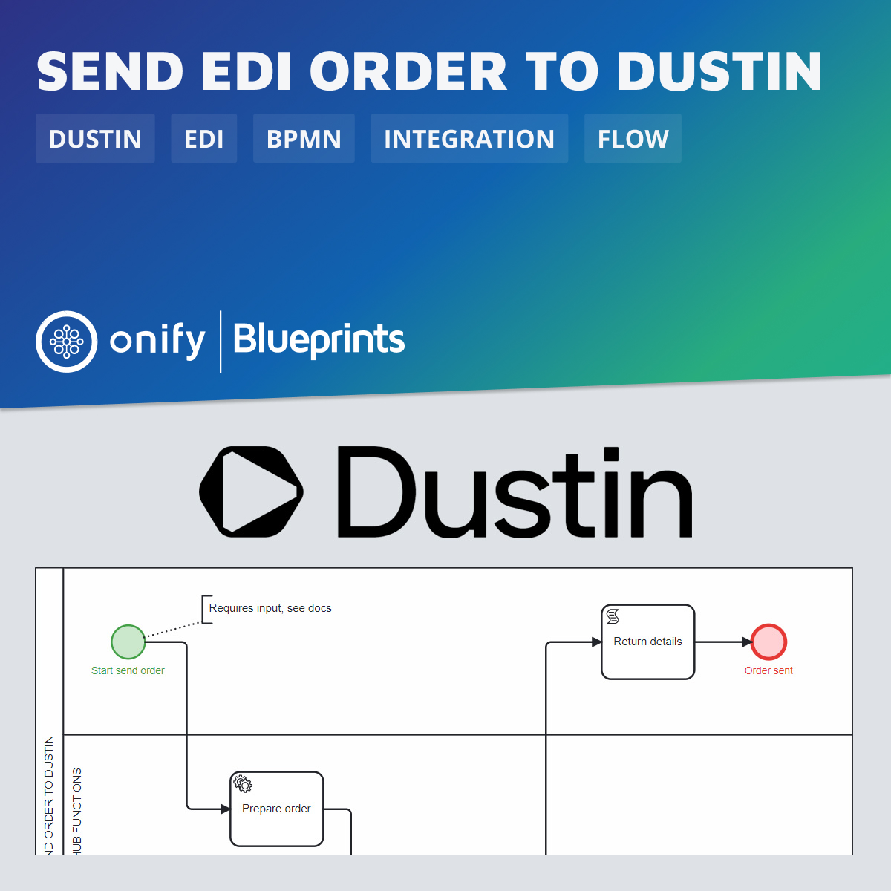

[](https://www.repostatus.org/#wip)


# Onify Blueprint: Send EDI order to Dustin

[Dustin](https://www.dustin.se/) is the leading Nordic internet retailer of computer and electronic equipment. Many nordic companies are buying products from Dustin – often using Dustin’s own portal for purchase. Now several companies are looking for a way to incorporate the Dustin procurement process in their own custom portal provided by Onify. 

This Blueprint is an example how to send a EDI order in XML format via Dustin web-service. It utilizes [Onify Hub Functions](https://github.com/onify/hub-functions) `/dustin/prepare/order` function.



## Requirements

* [Onify Hub](https://github.com/onify/install)
* [Onify Hub Functions](https://github.com/onify/hub-functions) v1.3.0 or later
* [Camunda Modeler](https://camunda.com/download/modeler/)
* Dustin (Active EDI agreement)

## Preperations

Make sure you have an agreement with [Dustin](https://www.dustin.se/) for EDI and can send orders via a web-service. Your IP needs to be whitelisted at Dustin or you will get a `Bad request` response when trying to send the order. You also need `ReceiverEdiPortalId` and `SenderEdiPortalId`.

## Deploy

1. Open the BPMN diagram in Camunda Modeler.
2. Deploy the BPMN diagram (click `Deploy current diagram` and follow the steps).

## Run

This workflow should be run as a _adhoc workflow_ and can be part of another process.

### Variables

* `OrderURL` - URL to send the order request
* `Order` - The EDI order
* `OrderRows` - The order rows

### Example request 

Here is an example how to get a secret using a simple `curl` command.

```bash
curl -X 'POST' \
  '{url}/api/v2/my/workflows/run/dustin-edi-send-order?timeout=180' \
  -H 'accept: application/json' \
  -H 'authorization: {auth-token}' \
  -H 'Content-Type: application/json' \
  -d '{
  "OrderURL": "https://testreceive-ediportal.dustin.eu/HttpHandler.ashx?FormatTypeName=xml&ReceiverEdiPortalId=EP-0000000999&SenderEdiPortalId=EP-0000000999",
  "Order": {
    "BuyerOrderNumber": "INC-1234",
    "Currency": "SEK",
    "Notes": "Some notes",
    "CostCenter": "AB123",
    "GoodsMarking": "Storage room",
    "BuyerParty": {
      "PartyID": "45607080",
      "TaxIdentifier": "SE555555550001",
      "Name": "Company AB",
      "Street": "Street 1",
      "PostalCode": "12345",
      "City": "City",
      "Country": "SE",
      "ContactName": "John Doe",
      "ContactPhone": "+46 76-123 44 55",
      "ContactEmail": "john.doe@company.se"
    }
  },
  "OrderRows": [
    {
      "PartID": "5010615730",
      "CommodityCode": "43211708",
      "Quantity": 1,
      "Price": 100,
      "Currency": "SEK"
    }
  ]
}'
```

## Support

* Community/forum: https://support.onify.co/discuss
* Documentation: https://support.onify.co/docs
* Support and SLA: https://support.onify.co/docs/get-support

## License

This project is licensed under the MIT License - see the [LICENSE](LICENSE) file for details.

## Contributors

Thanks [Tony Aronsson](https://github.com/Aronsson84) and [Joakim Jensen](oceansmoving) @ [Zitac](https://github.com/zitacconsulting) for the support.
